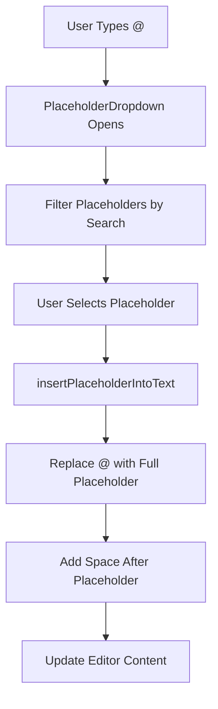
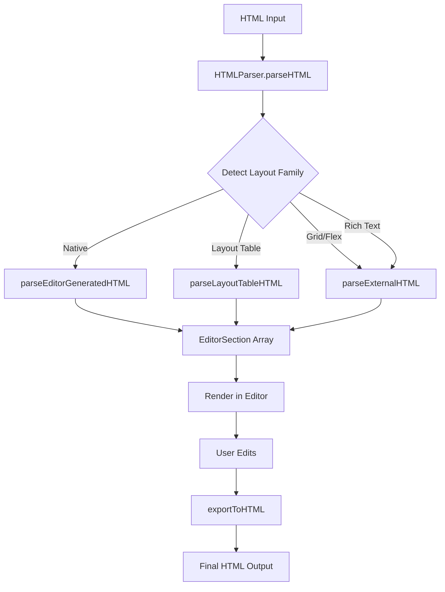
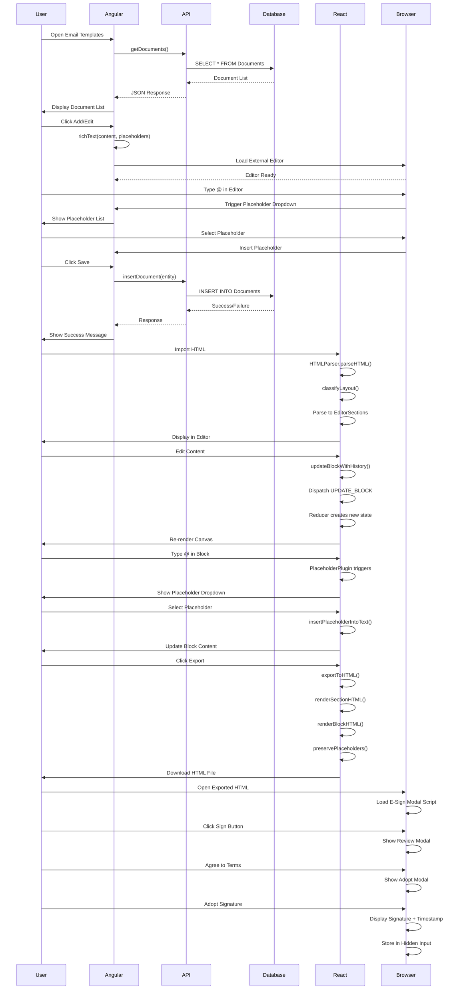

# HTML Editor Complete Flow Analysis

## System Overview

This document provides a comprehensive flow analysis of the HTML editor system used for email templates and documents, covering both the Angular (legacy) and React (new) implementations.

---

## 1. ANGULAR EMAIL/DOCUMENT EDITOR FLOW

### 1.1 Component Architecture

```
EmailComponent (email.component.ts)
├── Email Format Configuration
├── Auto Email Configuration  
├── Mail Server Configuration
└── Email Templates (Documents)
    └── Rich Text Editor Integration
```

### 1.2 Email Template Editor Initialization

```mermaid
graph TD
    A[User Opens Email Templates Tab] --> B[loadSubMenu(3)]
    B --> C[getDocuments API Call]
    C --> D[Load Document List]
    D --> E[User Clicks Add/Edit]
    E --> F[toggleFormView Opens Form]
    F --> G[richText Function Initialized]
    G --> H[External Editor Loaded]
    H --> I[Placeholder Support Enabled]
```

### 1.3 Rich Text Editor Integration

**Location**: `email.component.html` (lines 161-167, 895-901)

```html
<div id="editor" class="doceditor">
  <textarea class="texteditor" name="texteditor" rows="20"></textarea>
</div>
```

**Initialization**: `declare function richText(val, placeholder): any`

The `richText()` function is called with:
- `val`: Existing HTML content (for edit mode)
- `placeholder`: Placeholder list for dropdown

### 1.4 API Flow for Email Templates

#### A. GET Documents/Templates

**API**: `getDocuments()`

```typescript
ConfigService.getDocuments().subscribe(res => {
  // Returns: NewDataSet.GetDocuments
  // Structure: {
  //   TemplateID, FileName, FileType, 
  //   DocumentLanguage, Subject, Content, IsActive
  // }
})
```

**Response Structure**:
```xml
<NewDataSet>
  <GetDocuments>
    <TemplateID>123</TemplateID>
    <FileName>Welcome Email</FileName>
    <FileType>Email</FileType>
    <DocumentLanguage>English</DocumentLanguage>
    <Subject>Welcome to Our Service</Subject>
    <Content><![CDATA[<html>...</html>]]></Content>
    <IsActive>true</IsActive>
  </GetDocuments>
</NewDataSet>
```

#### B. INSERT Document/Template

**API**: `insertDocument(documentEntity)`

```typescript
documentEntity = {
  FileName: string,
  FileType: 'Email' | 'Document',
  DocumentLanguage: string,
  Subject: string,
  Content: string (HTML),
  IsActive: boolean,
  LastModifiedBy: userId,
  IPAddress: string
}
```

**Flow**:
```
1. User fills form
2. Rich text editor captures HTML content
3. Submit → insertDocument() API
4. Backend validates and stores
5. Returns success/failure
6. Refresh document list
```

#### C. UPDATE Document/Template

**API**: `updateDocument(documentEntity)`

```typescript
documentEntity = {
  TemplateID: number,
  FileName: string,
  FileType: string,
  DocumentLanguage: string,
  Subject: string,
  Content: string (HTML),
  IsActive: boolean,
  LastModifiedBy: userId,
  IPAddress: string
}
```

---

## 2. PLACEHOLDER SYSTEM

### 2.1 Placeholder Types

#### Standard Placeholders (@)
```
@CustomerName
@CustomerEmail
@CustomerPhone
@AccountNumber
@AccountType
@CurrentDate
@ExpiryDate
@CompanyName
@CompanyAddress
@AgentName
@AgentEmail
```

#### FinTech Placeholders (PH@)
```
PH@FirstName
PH@LastName
PH@PortfolioName
PH@PortfolioAddress
PH@PortfolioCity
PH@PortfolioState
PH@PortfolioZip
PH@PortfolioPhone
PH@PortfolioEmail
PH@LoanAmount
PH@APR
PH@InterestRate
PH@CABFeeRate
PH@TotalPayment
PH@DateNow
PH@LoanID
PH@CustomerAddress
PH@CustomerCity
PH@CustomerState
PH@CustomerZip
PH@MobilePhone
PH@SSN
PH@DOB
PH@IP
```

### 2.2 Placeholder API

**API**: `getPlaceHolder()`

```typescript
ConfigService.getPlaceHolder().subscribe(res => {
  // Returns list of available placeholders
  // Used to populate dropdown in rich text editor
})
```

### 2.3 Placeholder Insertion Flow (React Implementation)



**Code Flow** (`PlaceholderPlugin.tsx`):

```typescript
// 1. Trigger Detection
handleKeyDown(e) {
  if (e.key === '@') {
    openDropdown(position, '@', cursorPos)
  }
}

// 2. Search Filtering
const filteredPlaceholders = useMemo(() => {
  const term = searchTerm.toLowerCase().replace(/^(ph)?@/, '')
  let items = availablePlaceholders
  
  if (activeTab === 'standard')
    items = items.filter(p => p.format === 'standard')
  else if (activeTab === 'fintech')
    items = items.filter(p => p.format === 'fintech')
    
  if (term) {
    items = items.filter(p =>
      p.label.toLowerCase().includes(term) ||
      p.value.toLowerCase().includes(term)
    )
  }
  
  return items
}, [searchTerm, activeTab])

// 3. Insertion
function insertPlaceholderIntoText(
  text: string,
  placeholder: string,
  position: number
): string {
  // Find @ or PH@ position
  let atPosition = position
  for (let i = position; i >= 0; i--) {
    if (text.substring(i, i + 3) === 'PH@') {
      atPosition = i
      break
    } else if (text[i] === '@') {
      atPosition = i
      break
    }
  }
  
  // Find end position (space or newline)
  let endPosition = position
  for (let i = position; i < text.length; i++) {
    if (text[i] === ' ' || text[i] === '\n') {
      endPosition = i
      break
    }
    endPosition = i + 1
  }
  
  const before = text.substring(0, atPosition)
  const after = text.substring(endPosition)
  
  return before + placeholder + ' ' + after
}
```

---

## 3. REACT FORM EDITOR FLOW

### 3.1 HTML Import/Export Architecture



### 3.2 Layout Classification System

**File**: `HTMLParser.ts`

```typescript
function classifyLayout(doc: Document): ImportReport {
  const stats = {
    tableCount: number,
    nestedTableDepth: number,
    hasThElements: boolean,
    hasForms: boolean,
    hasImages: boolean,
    paragraphCount: number,
    inputCount: number,
    hasNativeMarkers: boolean
  }
  
  // Classification Logic:
  if (hasNativeMarkers) {
    return { family: 'native', confidence: 1.0, stats }
  }
  
  if (tableCount >= 1 && maxNestedDepth >= 2 && !hasThElements) {
    return { family: 'layout-table', confidence: 0.95, stats }
  }
  
  if (hasGridStyles || hasRowColClasses) {
    return { family: 'grid', confidence: 0.9, stats }
  }
  
  if (paragraphs.length >= 3 || inlineSpans.length >= 5) {
    return { family: 'rich-text', confidence: 0.85, stats }
  }
  
  return { family: 'fallback', confidence: 0.5, stats }
}
```

### 3.3 HTML Export Flow

**File**: `exportToHTML.ts`

```typescript
// 1. Block Rendering
function renderBlockHTML(block: EditorBlock): string {
  // Extract styles
  const margin = `margin-top: ${block.marginTop}px; ...`
  const padding = `padding-left: ${block.paddingX}px; ...`
  
  // Preserve placeholders
  const content = preservePlaceholders(block.content)
  
  // Generate HTML with data attributes
  return `<${tag} data-block-id="${block.id}" 
                   data-block-type="${block.type}"
                   style="${margin} ${padding}">
            ${content}
          </${tag}>`
}

// 2. Placeholder Preservation
function preservePlaceholders(str: string): string {
  const parts = str.split(/((?:PH)?@\w+)/g)
  return parts.map(part => {
    if (part.match(/^(?:PH)?@\w+$/)) {
      return `<span class="placeholder" 
                    style="background-color: #b3d4fc; padding: 0 2px;">
                ${escapeHtml(part)}
              </span>`
    }
    return escapeHtml(part)
  }).join('')
}

// 3. Section Rendering
function renderSectionHTML(section: EditorSection): string {
  const sectionAttr = `data-editor-section="true" 
                       data-editor-layout="${section.columns}"`
  
  if (section.columns === 1) {
    return `<div ${sectionAttr}>
              <div data-editor-column="0">
                ${blocks.map(renderBlockHTML).join('\n')}
              </div>
            </div>`
  }
  
  // Multi-column layout
  return `<div ${sectionAttr} 
               style="display: grid; 
                      grid-template-columns: repeat(${section.columns}, 1fr);">
            ${columns.map((col, idx) => `
              <div data-editor-column="${idx}">
                ${col.map(renderBlockHTML).join('\n')}
              </div>
            `).join('\n')}
          </div>`
}
```

### 3.4 Signature Block Handling

**Special Block Type**: `SIGNATURE`

```typescript
case BLOCK_TYPES.SIGNATURE: {
  const sigBlock = block as SignatureBlockProps
  return `<div id="${sigBlock.fieldName}" 
               data-signature-url="${sigBlock.signatureUrl}"
               class="signature-area">
    <div class="signature-display" style="display: none;"></div>
    <span class="sig-label">
      ${preservePlaceholders(sigBlock.label)}
      ${sigBlock.required ? '<span style="color:#ef4444;">*</span>' : ''}
    </span>
    <button type="button" 
            data-signature-button 
            data-field="${sigBlock.fieldName}" 
            class="sign-button">
      <svg>...</svg> Sign
    </button>
    <input type="hidden" 
           name="${sigBlock.fieldName}" 
           data-signature-value
           ${sigBlock.required ? 'aria-required="true"' : ''} />
  </div>`
}
```

**E-Sign Modal Flow** (Embedded in exported HTML):

```javascript
// 1. User clicks Sign button
signButtons.forEach(btn => {
  btn.addEventListener('click', function() {
    activeSignatureField = btn.getAttribute('data-field')
    reviewModal.style.display = 'block'
    openOverlay()
  })
})

// 2. User agrees to terms
continueBtn.addEventListener('click', function() {
  if (!agreeCheckbox.checked) return
  reviewModal.style.display = 'none'
  
  // Get signer name from form fields
  const signer = getSignerName()
  borrowerNameEl.textContent = signer.full
  adoptedSigPreview.textContent = signer.full
  
  adoptModal.style.display = 'block'
})

// 3. User adopts signature
adoptBtn.addEventListener('click', function() {
  const signer = getSignerName()
  const area = document.getElementById(activeSignatureField)
  
  // Display signature with timestamp
  display.innerHTML = `
    <span style="font-family: Allura, cursive; font-size: 26px;">
      ${signer.full}
    </span>
    <span style="font-size: 11px; color: #94a3b8;">
      ${new Date().toLocaleDateString()}
    </span>
  `
  
  // Hide sign button, store value
  btn.style.display = 'none'
  hidden.value = signer.full
  
  closeOverlay()
})
```

---

## 4. COMPLETE DATA FLOW DIAGRAM



---

## 5. FILE HANDLING FLOW

### 5.1 Angular File Upload (Logo)

```typescript
readFile(fileEvent) {
  if (fileEvent.target.files[0]) {
    let file = fileEvent.target.files[0]
    this.filename = file.name
    this.selectedfile = file
    this.path = "StoreLogo"
    this.selectedfile.destpath = this.path + "\\" + this.filename
  }
}

// On Submit
var formData = new FormData()
formData.append('logofile', this.selectedfile)
formData.append('emailConfigEntity', JSON.stringify(emailConfigEntity))

ConfigService.insemailformat(formData).subscribe(...)
```

### 5.2 React Image Block

```typescript
case BLOCK_TYPES.IMAGE:
  return `<div data-block-id="${block.id}"
               data-src="${escapeHtml(block.src)}"
               data-alt="${escapeHtml(block.alt)}">
    
  </div>`
```

---

## 6. PLACEHOLDER REPLACEMENT AT RUNTIME

### 6.1 Server-Side Replacement (Typical Flow)

```
1. User submits form with placeholders
2. Backend receives HTML with @CustomerName, PH@LoanAmount, etc.
3. Backend queries database for actual values
4. Backend performs string replacement:
   - @CustomerName → "John Doe"
   - PH@LoanAmount → "$5,000.00"
   - @CurrentDate → "2024-02-22"
5. Backend sends email with replaced values
```

### 6.2 Client-Side Preview (React)

```typescript
// In preview mode, show placeholder as-is with styling
function preservePlaceholders(str: string): string {
  const parts = str.split(/((?:PH)?@\w+)/g)
  return parts.map(part => {
    if (part.match(/^(?:PH)?@\w+$/)) {
      return `<span class="placeholder" 
                    style="background-color: #b3d4fc; 
                           padding: 0 2px;">
                ${escapeHtml(part)}
              </span>`
    }
    return escapeHtml(part)
  }).join('')
}
```

---

## 7. KEY DIFFERENCES: ANGULAR VS REACT

| Feature | Angular (Legacy) | React (New) |
|---------|-----------------|-------------|
| **Editor** | External rich text editor (TinyMCE/CKEditor) | Custom block-based editor |
| **Placeholder Trigger** | Editor plugin | Custom React hook |
| **HTML Storage** | Raw HTML string in database | Structured JSON + HTML export |
| **Import** | Direct HTML load | Intelligent parsing with layout detection |
| **Export** | Direct HTML save | Structured export with data attributes |
| **Undo/Redo** | Editor built-in | Custom history management |
| **Drag & Drop** | Not supported | Full DnD support |
| **Sections/Columns** | Manual HTML | Visual column builder |
| **Signature** | Custom implementation | Integrated block type |
| **Validation** | Form-level | Block-level + form-level |

---

## 8. API ENDPOINTS SUMMARY

### Angular APIs

```
GET  /api/getDocuments              - Fetch all email templates
POST /api/insertDocument            - Create new template
POST /api/updateDocument            - Update existing template
GET  /api/getPlaceHolder            - Get placeholder list
GET  /api/getEmailTemplates         - Get templates for dropdown
GET  /api/getAutoEmailDetails       - Get auto-email configs
POST /api/insertAutoEmail           - Create auto-email config
POST /api/updateAutoEmail           - Update auto-email config
GET  /api/getEmailTemplate          - Get email format config
POST /api/insemailformat            - Insert email format
POST /api/updateemailformat         - Update email format
GET  /api/getmailserver             - Get mail server configs
POST /api/insertMailServer          - Create mail server config
POST /api/updateMailServer          - Update mail server config
```

### React APIs (Potential)

```
POST /api/editor/import             - Import HTML to editor format
POST /api/editor/export             - Export editor to HTML
GET  /api/editor/templates          - Get saved templates
POST /api/editor/templates          - Save template
PUT  /api/editor/templates/:id      - Update template
DELETE /api/editor/templates/:id    - Delete template
GET  /api/editor/placeholders       - Get placeholder definitions
```

---

## 9. SECURITY CONSIDERATIONS

### 9.1 HTML Sanitization

**React Implementation** (`Sanitizer.ts`):

```typescript
export function sanitizeHTML(html: string): string {
  // Remove dangerous tags
  const dangerousTags = ['script', 'iframe', 'object', 'embed']
  
  // Remove event handlers
  html = html.replace(/on\w+\s*=\s*["'][^"']*["']/gi, '')
  
  // Remove javascript: URLs
  html = html.replace(/javascript:/gi, '')
  
  return html
}
```

### 9.2 Placeholder Injection Prevention

```typescript
function escapeHtml(str: string): string {
  return str
    .replace(/&/g, '&amp;')
    .replace(/</g, '&lt;')
    .replace(/>/g, '&gt;')
    .replace(/"/g, '&quot;')
}

// Placeholders are escaped before insertion
const content = preservePlaceholders(block.content)
```

---

## 10. TROUBLESHOOTING GUIDE

### Common Issues

1. **Placeholders not showing in dropdown**
   - Check `getPlaceHolder()` API response
   - Verify placeholder format (@word or PH@word)
   - Check filter logic in PlaceholderPlugin

2. **HTML import fails**
   - Check layout classification confidence
   - Verify HTML structure (nested tables, grid, etc.)
   - Check console for parsing errors

3. **Signature not working in exported HTML**
   - Verify e-sign modal script is included
   - Check form field names match signature field
   - Ensure jQuery/dependencies are loaded

4. **Placeholders not replaced in emails**
   - Backend replacement logic issue
   - Check placeholder format matches database
   - Verify API receives correct placeholder syntax

---

## 11. FUTURE ENHANCEMENTS

### Recommended Improvements

1. **Unified API Layer**
   - Create consistent REST API for both systems
   - Standardize request/response formats
   - Add versioning support

2. **Real-time Collaboration**
   - WebSocket integration for multi-user editing
   - Conflict resolution
   - Live cursor tracking

3. **Template Versioning**
   - Track template changes over time
   - Rollback capability
   - Diff viewer

4. **Advanced Placeholder System**
   - Conditional placeholders
   - Placeholder formatting options
   - Custom placeholder definitions

5. **A/B Testing**
   - Multiple template variants
   - Performance tracking
   - Automatic winner selection

---

## CONCLUSION

This document provides a complete flow analysis of the HTML editor system, covering:

✅ Angular email template editor with rich text integration  
✅ React form editor with block-based architecture  
✅ Placeholder system (@ and PH@ formats)  
✅ HTML import/export with intelligent parsing  
✅ Signature block with e-sign modal  
✅ API endpoints and data flow  
✅ File handling and security  
✅ Troubleshooting and future enhancements  

The system supports creating, editing, and managing email templates with dynamic placeholders, signature capture, and flexible layout options across both legacy Angular and modern React implementations.
